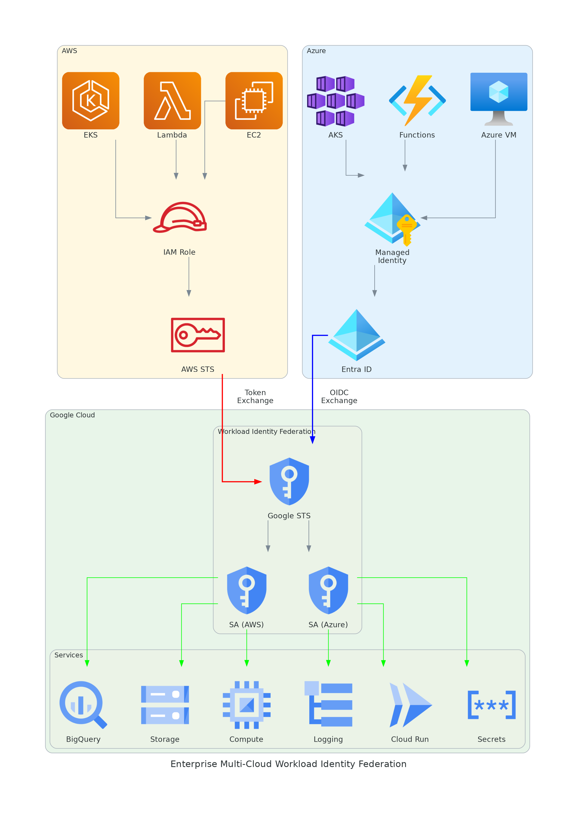
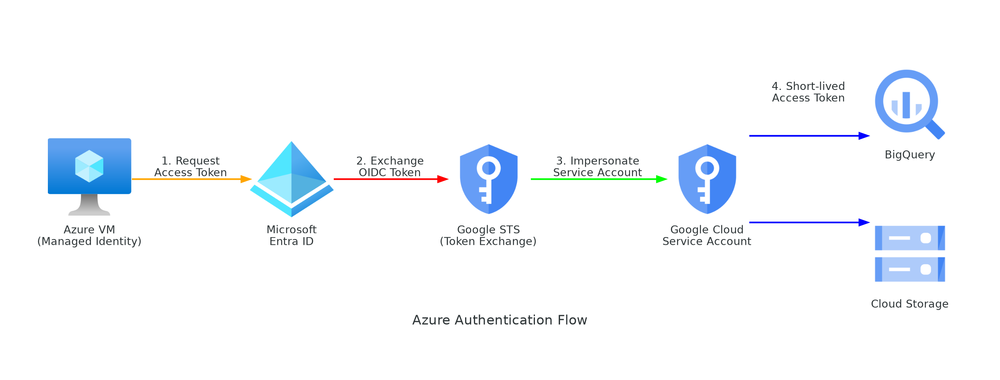

# Multi-Cloud Workload Identity Federation

Keyless cross-cloud authentication between **AWS**, **Azure**, and **Google Cloud** using Workload Identity Federation. No service account keys. No secrets to rotate. Zero Trust compliant.



## Overview

This repository provides production-ready guides and verified examples for configuring Google Cloud Workload Identity Federation across enterprise multi-cloud environments.

| Source Cloud | Target | Auth Method | Status |
|-------------|--------|-------------|--------|
| AWS (EC2, Lambda, EKS) | Google Cloud | IAM Role + STS SigV4 | Verified |
| Azure (VM, Functions, AKS) | Google Cloud | Managed Identity + OIDC JWT | Verified |

## Why Workload Identity Federation?

| | Service Account Key | Workload Identity Federation |
|---|---|---|
| Secrets to manage | JSON key file per workload | None |
| Key rotation | Manual | Automatic (1-hour token TTL) |
| Blast radius if leaked | Full SA access until revoked | N/A - nothing to leak |
| Audit trail | SA email only | Original cloud identity (ARN / Object ID) |
| Compliance | Fails CIS, SOC2 key mgmt controls | Zero Trust, SOC2, ISO 27001, CIS aligned |
| Cost | Free | Free |

## Verified Test Results

All use cases tested on 2026-03-29:

```
=== AWS -> GCP ===
UC1 BigQuery:   hamlet: 5318, kinghenryv: 5104, cymbeline: 4875    [PASS]
UC2 Storage:    Auth successful                                      [PASS]
UC3 Logging:    Write OK                                             [PASS]
UC4 Terraform:  Plan OK                                              [PASS]

=== Azure -> GCP ===
UC1 BigQuery:   hamlet: 5318, kinghenryv: 5104, cymbeline: 4875    [PASS]
UC2 Storage:    Auth successful                                      [PASS]
UC3 Logging:    Write OK                                             [PASS]
```

---

## Architecture

### AWS to Google Cloud


### Azure to Google Cloud



### Supported Use Cases


---

## Quick Start

### AWS to GCP

```bash
# 1. Create pool + provider
gcloud iam workload-identity-pools create aws-pool --location=global
gcloud iam workload-identity-pools providers create-aws aws-provider \
  --location=global --workload-identity-pool=aws-pool \
  --account-id=<AWS_ACCOUNT_ID> \
  --attribute-mapping="google.subject=assertion.arn"

# 2. Create SA + grant roles
gcloud iam service-accounts create aws-workload-sa
gcloud projects add-iam-policy-binding <PROJECT_ID> \
  --role=roles/bigquery.dataViewer \
  --member="serviceAccount:aws-workload-sa@<PROJECT_ID>.iam.gserviceaccount.com"

# 3. Grant impersonation (both roles required)
MEMBER="principal://iam.googleapis.com/projects/<PROJECT_NUMBER>/locations/global/workloadIdentityPools/aws-pool/subject/<FULL_AWS_ARN>"
gcloud iam service-accounts add-iam-policy-binding \
  aws-workload-sa@<PROJECT_ID>.iam.gserviceaccount.com \
  --role=roles/iam.workloadIdentityUser --member="$MEMBER"
gcloud iam service-accounts add-iam-policy-binding \
  aws-workload-sa@<PROJECT_ID>.iam.gserviceaccount.com \
  --role=roles/iam.serviceAccountTokenCreator --member="$MEMBER"

# 4. Generate credential config
gcloud iam workload-identity-pools create-cred-config \
  projects/<PROJECT_NUMBER>/locations/global/workloadIdentityPools/aws-pool/providers/aws-provider \
  --service-account=aws-workload-sa@<PROJECT_ID>.iam.gserviceaccount.com \
  --aws --enable-imdsv2 --output-file=gcp-credentials.json

# 5. Use on EC2
export GOOGLE_APPLICATION_CREDENTIALS=gcp-credentials.json
python3 -c "from google.cloud import bigquery; print(list(bigquery.Client().query('SELECT 1').result()))"
```

### Azure to GCP

```bash
# 1. Register Entra ID app + set App ID URI
az ad app create --display-name "gcp-wif" --sign-in-audience "AzureADMyOrg"
az ad app update --id <APP_ID> --identifier-uris "api://<APP_ID>"

# 2. Create pool + OIDC provider
gcloud iam workload-identity-pools create azure-pool --location=global
gcloud iam workload-identity-pools providers create-oidc azure-provider \
  --location=global --workload-identity-pool=azure-pool \
  --issuer-uri="https://sts.windows.net/<TENANT_ID>/" \
  --allowed-audiences="api://<APP_ID>" \
  --attribute-mapping="google.subject=assertion.sub"

# 3. Create SA + grant roles + impersonation (same as AWS)
# 4. Generate credential config
gcloud iam workload-identity-pools create-cred-config \
  projects/<PROJECT_NUMBER>/locations/global/workloadIdentityPools/azure-pool/providers/azure-provider \
  --service-account=azure-workload-sa@<PROJECT_ID>.iam.gserviceaccount.com \
  --azure --app-id-uri="api://<APP_ID>" --output-file=gcp-credentials.json
```

---

## Enterprise Best Practices

### 1. Pool and Provider Design

```
Organization
  |
  +-- Pool: aws-production
  |     +-- Provider: aws-account-111111111111
  |     +-- Provider: aws-account-222222222222
  |
  +-- Pool: aws-staging
  |     +-- Provider: aws-account-333333333333
  |
  +-- Pool: azure-production
  |     +-- Provider: azure-tenant-xxxxxxxx
  |
  +-- Pool: azure-staging
        +-- Provider: azure-tenant-yyyyyyyy
```

- Separate pools per environment (production, staging, development)
- Separate providers per AWS account or Azure tenant
- Never share pools across environments

### 2. Attribute Mapping and Conditions

Use attribute conditions to restrict which identities can authenticate:

```bash
# AWS: Only allow specific roles
--attribute-condition="assertion.arn.startsWith('arn:aws:sts::<ACCOUNT_ID>:assumed-role/')"

# AWS: Only allow specific role name
--attribute-condition="assertion.arn.contains('assumed-role/production-app/')"

# Azure: Only allow specific managed identity
--attribute-condition="assertion.sub == '<MANAGED_IDENTITY_OBJECT_ID>'"
```

### 3. Service Account Strategy

| Pattern | When to Use |
|---------|-------------|
| One SA per workload | Production - maximum isolation |
| One SA per team | Staging - balance of isolation and management |
| One SA per environment | Development only - not for production |

Grant minimum required roles:

```bash
# Bad: Project-level editor
--role=roles/editor  # DO NOT USE

# Good: Resource-level, specific role
gcloud storage buckets add-iam-policy-binding gs://specific-bucket \
  --role=roles/storage.objectViewer \
  --member="serviceAccount:..."
```

### 4. Credential Configuration Security

The credential config file contains no secrets, but treat it as sensitive:

- Store in version control (safe - no secrets)
- For Lambda/Functions: bundle in deployment package
- For Kubernetes: use ConfigMap or Secret
- For CI/CD: store in pipeline secrets manager
- Never hardcode project numbers in application code - use the config file

### 5. Monitoring and Audit

Enable Cloud Audit Logs to track federated access:

```bash
# View federated token exchanges
gcloud logging read 'resource.type="audited_resource" AND protoPayload.serviceName="sts.googleapis.com"' \
  --project=<PROJECT_ID> --limit=10

# View SA impersonation events
gcloud logging read 'resource.type="service_account" AND protoPayload.methodName="GenerateAccessToken"' \
  --project=<PROJECT_ID> --limit=10
```

### 6. Network Security

- Restrict STS endpoint access via VPC Service Controls
- Use regional STS endpoints for data residency requirements:
  ```
  https://sts.us-central1.rep.googleapis.com/v1/token
  https://sts.europe-west1.rep.googleapis.com/v1/token
  ```

### 7. Disaster Recovery

- Credential config files are stateless - no backup needed
- Pool/Provider configuration: export via Terraform or `cf-terraforming`
- SA permissions: manage via IaC (Terraform)
- Token exchange is automatic - no manual intervention during failover

### 8. Organizational Policy Constraints

Apply org policies to enforce WIF usage:

```bash
# Disable SA key creation (force WIF usage)
gcloud org-policies set-policy --project=<PROJECT_ID> << 'EOF'
constraint: iam.disableServiceAccountKeyCreation
booleanPolicy:
  enforced: true
EOF

# Restrict allowed external identity providers
gcloud org-policies set-policy --project=<PROJECT_ID> << 'EOF'
constraint: iam.workloadIdentityPoolProviders
listPolicy:
  allowedValues:
    - "aws"
    - "oidc"
EOF
```

---

## Terraform Modules

### AWS to GCP

See [terraform/aws-to-gcp/](terraform/aws-to-gcp/)

### Azure to GCP

See [terraform/azure-to-gcp/](terraform/azure-to-gcp/)

---

## Cost

| Component | Cost |
|-----------|------|
| Workload Identity Pool, Provider | Free |
| Token exchange (STS API calls) | Free |
| Service Account impersonation | Free |
| AWS IAM Role, STS | Free |
| Azure Managed Identity, Entra ID App | Free |
| Credential configuration file | Free |

Only the target GCP services incur costs (BigQuery, Storage, etc.) based on their standard pricing.

---

## Advanced Patterns

### Hub-and-Spoke (Enterprise Multi-Cloud)

For organizations with many AWS accounts and Azure subscriptions, the Hub-and-Spoke pattern routes all federation through dedicated trust anchors:

- **AWS:** A dedicated hub account (no workloads) — one WIF provider
- **Azure:** A single Entra ID App Registration — one WIF provider

```
AWS Spoke Accounts ──→ Hub Account ──→ GCP WIF Pool (aws-{env})
Azure Subscriptions ──→ Hub App ──→ GCP WIF Pool (azure-{env})
```

**Key benefits:**
- Scales to hundreds of workloads without adding WIF providers
- Adding workloads requires only IAM changes (no GCP pool changes)
- Centralized audit trail across both clouds
- Environment isolation via separate pools

📖 **Full guide:** [`docs/hub-and-spoke-pattern.md`](docs/hub-and-spoke-pattern.md)

### Kubernetes to GCP (EKS + AKS)

Both EKS IRSA and AKS Workload Identity provide pod-level keyless identity:

| Platform | Flow |
|----------|------|
| EKS | Pod (IRSA) → Hub Role → GCP WIF (SigV4) → GCP SA |
| AKS | Pod (Workload Identity) → Entra ID JWT → GCP WIF (OIDC) → GCP SA |

📖 **Full guide:** [`docs/kubernetes-to-gcp.md`](docs/kubernetes-to-gcp.md)  
🐳 **Demo app:** [`examples/fastapi-gcs-service/`](examples/fastapi-gcs-service/) — Multi-cloud FastAPI GCS service

## Enterprise Security Hardening

Based on [GCP Official Best Practices](https://cloud.google.com/iam/docs/best-practices-for-using-workload-identity-federation) and aligned with CIS, SOC2, ISO 27001, and NIST 800-53.

| Control | Description |
|---------|-------------|
| Dedicated WIF project | Centralized pool/provider management with org policy enforcement |
| One provider per pool | Prevents subject collisions between providers |
| Attribute conditions | Mandatory in production — restrict which identities can authenticate |
| Immutable attributes | `assertion.arn` (AWS), `assertion.sub` (Azure) — never email |
| VPC Service Controls | Restrict STS endpoint access + regional endpoints for data residency |
| Data Access Logs | Enable for `sts.googleapis.com` and `iamcredentials.googleapis.com` |
| Org policy constraints | Disable SA key creation/upload, restrict provider types |
| IAM Deny Policies | Prevent accidental deletion of WIF resources |

📖 **Full guide:** [`docs/enterprise-security-hardening.md`](docs/enterprise-security-hardening.md)

---

## Troubleshooting

| Error | Cause | Fix |
|-------|-------|-----|
| `iam.serviceAccounts.getAccessToken denied` | Missing `serviceAccountTokenCreator` role | Grant both `workloadIdentityUser` AND `serviceAccountTokenCreator` |
| `Unable to retrieve AWS region` | No IAM Role or IMDS disabled | Check `aws sts get-caller-identity`; remove `--enable-imdsv2` for IMDSv1 |
| `Invalid audience` (Azure) | App ID URI mismatch | Verify `--allowed-audiences` matches Entra ID App ID URI |
| `Token validation failed` (Azure) | Wrong issuer URI | Use `https://sts.windows.net/<TENANT_ID>/` (trailing slash required) |
| `Subject mismatch` | ARN or Object ID doesn't match | Check actual identity with `aws sts get-caller-identity` or decode JWT |
| `The caller does not have permission` | SA missing role for target service | Grant appropriate role per service |

---

## References

- [GCP: Workload Identity Federation with AWS/Azure](https://cloud.google.com/iam/docs/workload-identity-federation-with-other-clouds)
- [GCP: WIF with Kubernetes](https://cloud.google.com/iam/docs/workload-identity-federation-with-kubernetes)
- [GCP: WIF Best Practices](https://cloud.google.com/iam/docs/best-practices-for-using-workload-identity-federation)
- [AWS: IAM Roles for EC2](https://docs.aws.amazon.com/AWSEC2/latest/UserGuide/iam-roles-for-amazon-ec2.html)
- [Azure: Managed Identities](https://learn.microsoft.com/en-us/azure/active-directory/managed-identities-azure-resources/overview)
- [Terraform: Google Cloud Provider](https://registry.terraform.io/providers/hashicorp/google/latest/docs)

## License

MIT License - see [LICENSE](LICENSE)
